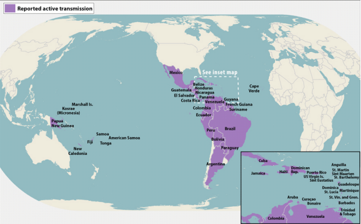
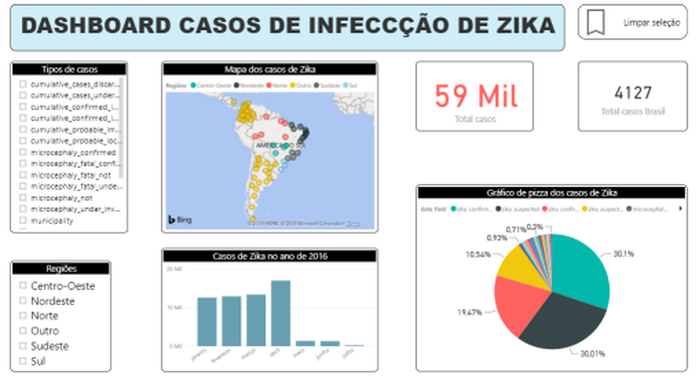

# BUSINESS INTELLIGENCE ETL PROJECT

This project consists on Extracting, Transforming and Loading (ETL) data from kaggle's database of zika disease in some regions of the world.

All the project is written in Portuguese.

The Zika virus disease, transmited mostly by the Aedes Aegypti mosquito, has infected thousands of people globally since 2015. Although it was discovered in an isolated region in Uganda on 1947, the lack of knowledge about the disease brought inumerous challenges for the cientific community to understand quickly its devastating effects, once the epidemy still grows and continues to spread today.

The softwares used were PostgreSQL to load the data, Pentaho for the data transformations and dashboards on Power BI.

The database has report dates of when the disease was firt seen (report_date), location it was reported (location_), city or providence (location_type), a breaf description of the infection caused by the virus (data_field), a ISO-3166 alpha-2 code (see Apendix) determined by the country where the disease occured (data_field_code), a period of infection if persisted for a long time (time_period - optional, otherwhise N/A), a time type period determined by the country where the disease was reported (time_period_type - only if time_period exists), an observation specifically indicated by report_date, location, data_field and time_period (value__) and the measure unit correspondent to data_field where the disease was reported (unit).

Below we can see a map of the studied cases of zika in some regions of the world.

  

The database can be found in https://github.com/cdcepi/zika 

After the required transformations in database, a Dashboard was created showing a filter of the type of zika cases, the total of cases studied, the total of cases in Brasil, the cases filtered by states in Brasil, the total of cases in 2016 in each region of the world and a pizza graph of the zika types.

